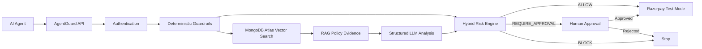

# AgentGuard

AgentGuard is a context-aware payment authorization and security layer for autonomous AI agents. It combines deterministic security guardrails, RAG-powered organizational policy intelligence, explainable risk scoring, human approvals, and Razorpay. It returns `approved`, `review`, or `blocked`; an LLM can never authorize or execute a payment by itself.



This repository preserves the existing React/Vite interface and connects it to a Python/FastAPI and MongoDB backend.

## Architecture and stack

- React 19 + Vite frontend with one centralized client in `frontend/src/api/client.js`
- FastAPI and Pydantic REST API
- modern asynchronous PyMongo client and programmatic MongoDB indexes
- JWT human sessions, server-side workspace membership, and RBAC
- hashed random agent/API credentials; plaintext returned once
- deterministic versioned policy and explainable risk engines
- atomic, versioned approval decisions and authorization idempotency
- mock payments by default; Razorpay Test Mode and signed webhooks when configured
- immutable audit events and measured authorization traces
- configurable policy cleaning/chunking and provider-neutral embeddings
- tenant-filtered Atlas Vector Search with local cosine fallback for development
- schema-validated LLM JSON, conservative failure handling, and immutable decision evidence

The backend separates route handlers, services, engines, database configuration, and external integrations under `backend/app/`.

## Local setup

Prerequisites: Python 3.11+, Node.js 20+, npm, and MongoDB 7+ (local or Atlas).

```bash
cd backend
python3 -m venv .venv
source .venv/bin/activate
pip install -r requirements.txt
cp .env.example .env
python seed.py
uvicorn app.main:app --reload --port 8000
```

In another terminal:

```bash
cd frontend
npm install
VITE_API_BASE_URL=http://localhost:8000 npm run dev
```

Open `http://localhost:5173`. The seed login is `demo@agentguard.app` / `AgentGuard123!`. Seed-created agent credentials are printed exactly once. Re-running the seed does not reveal existing credentials.

## Accounts and workspace administration

Users can create an account from the sign-in screen. Registration creates their first isolated workspace and assigns them the `admin` role. Workspace admins can open **Workspace Admin** to create additional workspaces, add existing registered users, change member roles, and remove members. AgentGuard prevents removal or demotion of the last active workspace admin.

A user can belong to multiple workspaces with a different role in each. The selected workspace is sent as `X-Workspace-ID` on API requests, and the backend validates the caller's active membership before accessing tenant data.

For Atlas, set `MONGODB_URI` to the Atlas connection string and `MONGODB_DB_NAME=agentguard`. Never commit `.env`.

## Configuration

See `backend/.env.example`. Set a random `JWT_SECRET` of at least 32 characters outside local demos. `PAYMENT_MODE=mock` works without payment credentials. For Razorpay Test Mode, use `PAYMENT_MODE=razorpay` and configure `RAZORPAY_KEY_ID`, `RAZORPAY_KEY_SECRET`, and `RAZORPAY_WEBHOOK_SECRET`; point the provider webhook at `POST /v1/payments/razorpay/webhook`.

`AI_POLICY_PROVIDER=mock` uses the deterministic fallback parser. Generated policy JSON is a Pydantic-validated draft and must be published by an admin; AI output never authorizes payments.

For RAG, configure `EMBEDDING_PROVIDER`, `EMBEDDING_MODEL`, `EMBEDDING_DIMENSIONS`, `LLM_PROVIDER`, `LLM_MODEL`, `OPENAI_API_KEY`, `RAG_CHUNK_SIZE`, `RAG_CHUNK_OVERLAP`, `RAG_TOP_K`, `MONGODB_VECTOR_INDEX`, and `AI_RATE_LIMIT_PER_MINUTE`. The `mock` providers are deterministic and require no network access. Policies are marked `indexing_failed` if embedding generation fails; authorization continues with deterministic guardrails and conservative review behavior.

## MongoDB Atlas Vector Search

Create a Vector Search index named `policy_chunks_vector` (or the value of `MONGODB_VECTOR_INDEX`) on the `policy_chunks` collection. Its vector field is `embedding`, dimensions must equal `EMBEDDING_DIMENSIONS`, similarity should be `cosine`, and `workspace_id` must be declared as a filter field. Example definition:

```json
{
  "fields": [
    { "type": "vector", "path": "embedding", "numDimensions": 1536, "similarity": "cosine" },
    { "type": "filter", "path": "workspace_id" }
  ]
}
```

Every retrieval query includes the authenticated workspace filter. Local MongoDB automatically falls back to an in-process cosine search over that workspace's chunks; this is for demos, not large production corpora.

## RAG and decision flow

Policy content is cleaned, split into configurable overlapping chunks, embedded through the provider abstraction, and stored with policy/workspace metadata. Authorization builds a semantic query from the agent, amount, merchant, verification state, category, purpose, payment type, and history. Retrieved snippets are passed to a constrained LLM prompt and validated against a strict Pydantic schema. The hybrid engine weighs transaction signals and policy analysis, while deterministic blocks always win. Failed AI calls never turn a suspicious request into an automatic approval.

## Production deployment

The production compose stack runs the API as a non-root user, serves the optimized frontend through Nginx, keeps MongoDB on an internal network with authentication and persistent storage, and exposes only the frontend/reverse-proxy port.

```bash
cp .env.production.example .env.production
# Replace every placeholder and set your real HTTPS origin first.
docker compose --env-file .env.production -f docker-compose.production.yml up -d --build
docker compose --env-file .env.production -f docker-compose.production.yml ps
```

Terminate TLS at your load balancer or ingress and forward traffic to `APP_PORT`. The API refuses to start in production with the demo JWT secret, an HTTP browser origin, an unsupported payment mode, or incomplete Razorpay credentials. Use `/api/health` for liveness and `/api/ready` for MongoDB readiness. API docs remain available locally but are disabled in production.

Set `PUBLIC_SITE_URL` to the canonical HTTPS origin. The production build injects absolute canonical and social-preview URLs, while authenticated workspace views and API responses are marked `noindex` to keep customer and payment data out of search results.

Before real payments, use Razorpay live keys only in a `live` workspace, configure the signed webhook endpoint at `https://your-domain/api/v1/payments/razorpay/webhook`, and run your provider reconciliation and disaster-recovery checks. Do not run `seed.py` in production.

## Authorization example

Money is always integer minor units: ₹8,450 is `845000` INR.

```bash
curl -X POST http://localhost:8000/v1/authorizations \
  -H 'Content-Type: application/json' \
  -H 'X-Agent-Key: <one-time-agent-secret>' \
  -d '{
    "agent_id":"agt_travel_01",
    "amount":845000,
    "currency":"INR",
    "merchant":{"name":"IndiGo","category":"airline","country":"IN"},
    "purpose":"Flight booking",
    "intent":{"description":"Book Kozhikode to Bengaluru","justification":"Client meeting"},
    "idempotency_key":"booking_127",
    "metadata":{"order_reference":"TRIP-102"}
  }'
```

The response includes a transaction ID, deterministic decision, stable reason codes, policy version, risk band, allowed actions, request ID, and an approval reference when review is required. Transaction detail retains the complete policy snapshot, checks, risk signals, and measured decision trace.

## Demo scenarios

- TravelAgent, ₹8,450, IndiGo/airline: known allowed merchant, low risk, approved and paid in mock mode.
- ProcurementAgent, ₹34,000, new international supplier: review; the Approval Center can approve it once and initiate payment.
- InvestmentAgent, ₹80,000, cryptocurrency: hard `CATEGORY_BLOCKED`; no payment call occurs.

The seed creates schema-compatible history for all three states.

The **Policy Intelligence** page shows status, category, chunks, indexing state, content, and re-index controls. Transaction detail includes **Why this decision?**, retrieved snippets and similarity scores, structured **AI Policy Reasoning**, and the decision timeline. For a live demo: sign in, create and index a finance policy, submit an authorization with a printed agent key, inspect its evidence, then approve or reject review decisions from the Approval Center.

## Security design

Tenant reads and mutations use the active membership workspace from `X-Workspace-ID`; caller-supplied document workspace IDs are ignored. RBAC is enforced for admin, approver, developer, and viewer roles. Secrets and passwords are hashed, provider secrets are environment-only, CORS is explicit, request IDs are returned, approval updates use compare-and-set conditions, webhook events and authorization retries are deduplicated, and blocked/rejected/expired transactions cannot enter payment processing.

For production, add refresh-token rotation/revocation, distributed rate limiting, encrypted secret management, MongoDB transactions for multi-document state changes, a reservation ledger, stronger merchant identity, MFA/SSO, provider reconciliation, structured telemetry, and independent security review. The risk engine is explainable hackathon logic, not a fraud ML model.

## Tests and verification

```bash
python -m unittest discover -s backend/tests -v
cd frontend && npm run lint && npm run build
```

The deterministic tests cover the primary outcomes. Before deployment, run integration tests against disposable MongoDB for approval races, idempotency, workspace isolation, paused/revoked credentials, payment gating, and webhook replay.

Interactive API documentation is at `http://localhost:8000/docs` while the backend runs. The detailed frontend-to-backend product map remains in `FRONTEND_BACKEND_AUDIT.md`.
